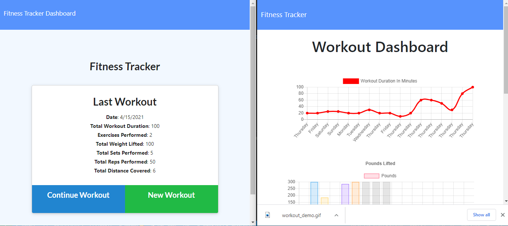

# Unit 17 NoSQL Homework: Workout Tracker

  

  
 ## Table of Contents
  
* [Description](#Description)
  
* [Installation](#Installation)
  
* [Usage](#Usage)
  
* [License](#License)
  
* [Contributors](#Contributors)
  
* [Questions](#Questions)
  
 ## Description 
  
or this assignment, I created a workout tracker that required me to create Mongo database with a Mongoose schema and handle routes with Express.
The user, will be able to view create and track daily workouts. In addition, to be able to log multiple exercises in a workout on a given day, be able to track the name, type, weight, sets, reps, and duration of exercises. If the exercise is a cardio exercise, I should be able to track my distance traveled. This will enable a consumer to reach their fitness goals more quickly when they track their workout progress.

PHOTO OF MY ASSIGNMENT:

 

[link to my assignment](https://github.com/rabiahfh/workout_tracker)

 ## Installation
  
 💾 
  
* npm i
npm start
  

    
 ## Usage
 

 This  FRONT END USER application allows users to:

  * Add exercises to the most recent workout plan.

  * Add new exercises to a new workout plan.

  * View the combined weight of multiple exercises from the past seven workouts on the `stats` page.

  * View the total duration of each workout from the past seven workouts on the `stats` page.

 
 
LANGUAGES USED ARE:
 
FRONT END

- HTML
- CSS

BACKEND
- JAVASCRIPT
- NODE.JS
- MONGODB
- MONGODB:ATLAS
- HEROKU

How do you deliver this?:

* Use the [MySQL](https://www.npmjs.com/package/mysql) NPM package to connect to your MySQL database and perform queries.

* Use [InquirerJs](https://www.npmjs.com/package/inquirer/v/0.2.3) NPM package to interact with the user via the command-line.

* Use [console.table](https://www.npmjs.com/package/console.table) to print MySQL rows to the console. There is a built-in version of `console.table`, but the NPM package formats the data a little better for our purposes.
 
PLEASE SEE THE DEMO BELOW:

  

 ## License
 To view the license click [here](https://choosealicense.com/licenses/mit/)

  
 ## Contributors
  
 Contributions are accepted. Feel free to fork.
1. Fork it
2. Create your feature branch (git checkout -b feature/fooBar)
3. Commit your changes (git commit -am 'Add some fooBar').
4. Push to the branch (git push origin feature/fooBar)
5. Create a new Pull Request# RfHogans

  
  
 ## Questions
  
 If you want have any additional questions, you can reach me at
  
 **Github**: https://github.com/rabiahfh
  
 **Email**: hogansrabiah@gmail.com

``